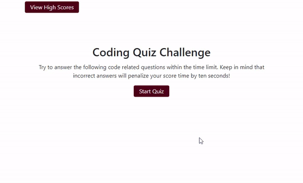

# JavaScript Quiz

## Description

This assessment is powered by JavaScript code, with dynamically updated HTML and CSS. It also displays a timer that begins with a click, and renders multiple-choice questions. Score is tracked and once completed, the high scores along with entered initials are rendered.
## Contents

1. [Demo](#quiz-demo)
2. [GitHub](#github)
3. [Contact Info](#contact-information)

## Design

To begin taking this coding quiz
- The client will click on the start button
- The timer will begin and first question will be presented

When a question is answered correctly
- A "Correct!" message appears
- The next question will be presented

When a question is answered incorrectly
- A "Wrong!" message appears
- Time will be deducted from the timer

When all questions are answered or the timer reaches 0
- The game is over
- The final score is totalled and presented

Once the game is over
- Client is able to save their score after entering their initials
- Once submit is clicked, the score is saved as long as initials are present
- A message will appear, if no initials are entered

## Quiz Demo

The following animation demonstrates the application functionality:

## GitHub

- [Deployed Version](https://rudy-menjivar.github.io/JavaScriptQuiz/)
- [GitHub Repository](https://github.com/Rudy-Menjivar/JavaScriptQuiz)

## Technologies Used

* [HTML](https://developer.mozilla.org/en-US/docs/Glossary/HTML)
* [Javascript](https://developer.mozilla.org/en-US/docs/Web/JavaScript)
* [CSS](https://developer.mozilla.org/en-US/docs/Glossary/CSS)

## Contact Information

[LinkedIn](https://www.linkedin.com/in/rudy-menjivar-)

## License

Copyright (c) Rudy Menjivar. All rights reserved.

Licensed under the [MIT](LICENSE.txt) license.